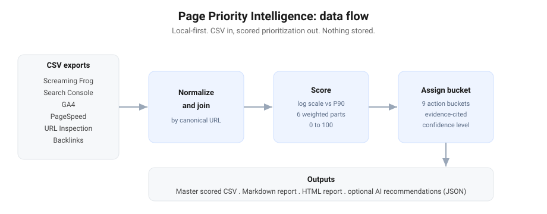
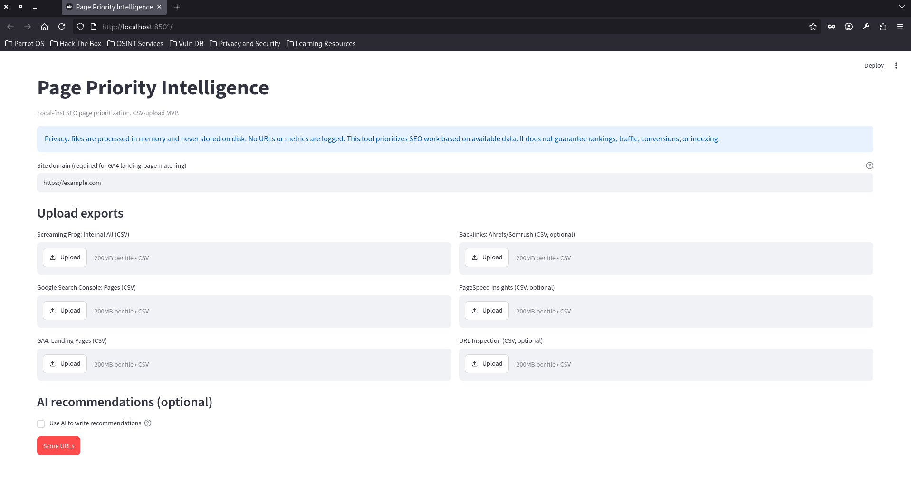
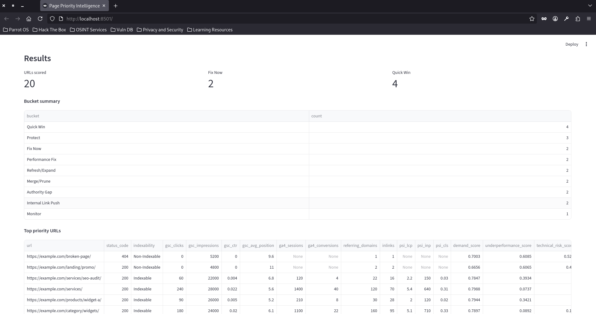
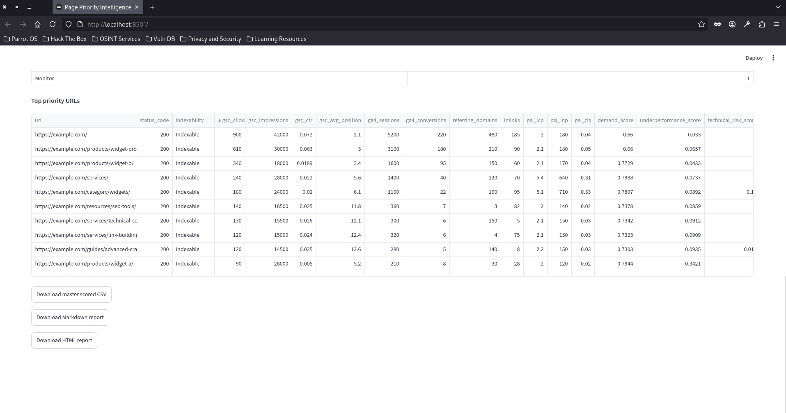
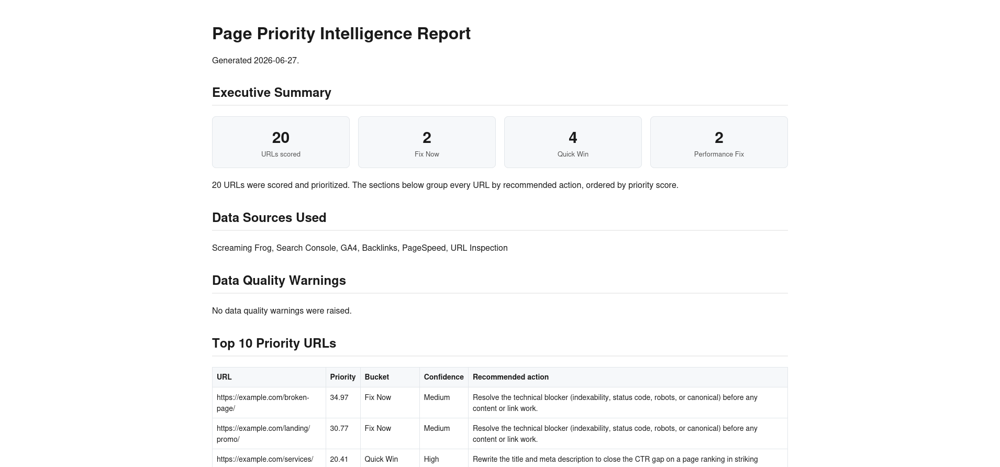

# Page Priority Intelligence

A local-first tool that merges Screaming Frog, Google Search Console, GA4, URL Inspection,
PageSpeed Insights, and backlink exports into a single scored, URL-level report. It tells
you which pages to work on next and why, ranked by a transparent priority score.

This is the Phase 1 CSV-only foundation. You export CSVs from each tool, upload them, and
get back a scored master CSV plus an unmatched-rows report. There are no API integrations
and no live data pulls in this version. Everything runs on your machine.

## Demo and screenshots



The screenshots below are captured from a local run on the bundled placeholder
sample data, so no real site data appears in this repository.









## What it does

It builds one row per crawled URL, joins the other sources onto that row by normalized
URL, scores each page across six components, and assigns an action bucket and a confidence
level. The output is a ranked list you can sort, filter, and hand to whoever does the
work.

The scoring model is documented in full in `docs/scoring_model.md`. Every input and output
field is defined in `docs/data_dictionary.md`. Both are worth reading before you trust the
numbers.

## What it does not do

It does not guarantee rankings, traffic, conversions, or indexing outcomes. The priority
score is a relative ranking signal that points attention at the pages most likely to repay
effort. It is not an absolute grade, and a low score does not mean a page is fine.

It does not pull data from any platform. You supply the exports. It does not store your
uploads. See `PRIVACY.md` for the data-handling guarantees and `SECURITY.md` for reporting
issues.

It does not use a Screaming Frog API to connect platforms. Screaming Frog has no public API
for that. The platform joining and scoring is done locally by this tool through URL
normalization. Screaming Frog's own integrations pull Google data into a crawl using your
Google credentials, which is a different mechanism and is out of scope for this CSV-only
phase.

## Requirements

Python 3.10 or newer. The dependencies are pinned in `requirements.txt`: pandas, numpy,
pydantic v2, and streamlit, plus pytest for the test suite.

## Install and run locally

Clone or copy the project, then from the project root:

```
pip install -r requirements.txt
streamlit run app/streamlit_app.py
```

The Streamlit app opens in your browser. Upload the CSVs you have. Screaming Frog and
Search Console are required because they define the page universe and the demand signal.
GA4, backlinks, PageSpeed, and URL Inspection are optional and improve coverage and
confidence when present. If your GA4 export is path-only, set your site domain in the app
so those rows can be joined.

When the run finishes you can download the scored master CSV, the unmatched-rows
CSV, and stakeholder-facing Markdown and HTML reports. Both reports group every URL by
recommended action and include an executive summary, the data sources used, data
quality warnings, a methodology section, and next steps.

## Try it with the sample data

The `sample_data` folder contains a complete set of six template CSVs for `example.com`.
Upload them as-is to see a full scored report without exporting anything from your own
tools. The templates also show the column headers each source is expected to provide.

## Run the tests

```
pytest
```

The suite covers URL normalization and the scoring engine, including an end-to-end run
over the sample data that asserts every crawled URL is scored exactly once, every score
falls in the valid range, and the results are sorted correctly.

## Project layout

```
app/                 Streamlit upload interface
src/ppi/             The package
  config.py          Scoring weights, tracking-param list, settings
  normalization/     URL normalization utilities
  schemas/           Pydantic models for input rows and scored output
  ingestion/         One CSV reader per source
  scoring/           Normalization, baselines, components, priority, buckets
  pipeline.py        Joins sources and runs the full scoring pass
sample_data/         Six template CSVs for example.com
tests/               URL normalization and scoring tests
docs/                scoring_model.md and data_dictionary.md
```

## Configuration

Copy `.env.example` to `.env` and set `PPI_SITE_DOMAIN` if you want GA4 path-only exports
to join automatically. The commented API-key entries in `.env.example` are placeholders
for a later phase and are unused in this version.

## Optional AI recommendations

The recommendation prose can optionally be written by OpenAI or Claude. This is
off by default and never required. When enabled in the app, only structured
facts for the top URLs are sent: the URL, the already-computed bucket and
priority score, the metrics that are present, evidence flags, and a list of
which metrics are missing. Raw uploads are never sent, the AI does not calculate
scores, and the score and bucket it returns are overwritten with the
authoritative values. Every response is validated against a fixed JSON schema,
and any missing key, malformed response, or absent API key falls back to the
rule-based writer, so output is always valid.

To enable it, install the relevant SDK (`pip install openai` or
`pip install anthropic`) and set `OPENAI_API_KEY` or `ANTHROPIC_API_KEY` in your
environment. With no key, the tool uses rule-based recommendations automatically.

## Roadmap

Phase 1 (this version) is CSV-only. Later phases add period-over-period decay scoring once
two time periods are ingested, and direct live pulls from the Google APIs (Search Console,
GA4, PageSpeed Insights) using your own credentials, replacing the manual export step. Live
pulls will use Google's APIs directly, not a Screaming Frog API.
